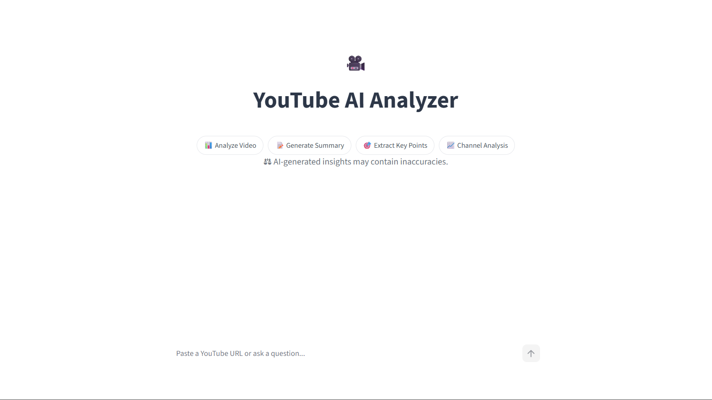
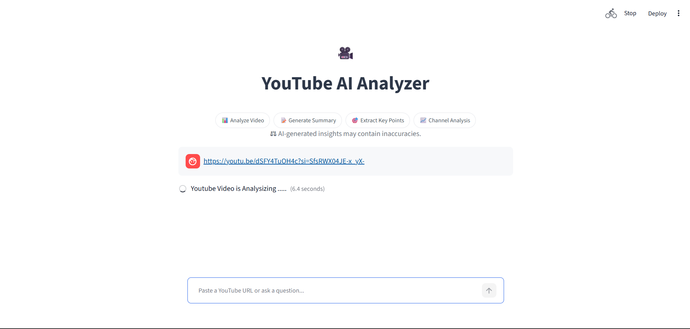
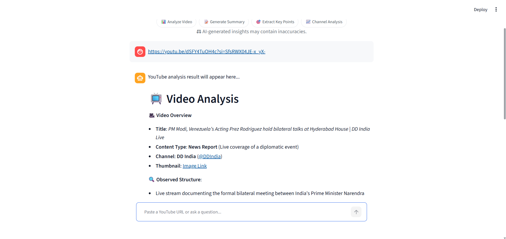

# 🎥 YouTube Analyzer AI

An AI-powered YouTube video analysis tool built with Streamlit, Agno, and Groq. This application analyzes YouTube videos and generates detailed summaries, timestamps, key learnings, tools mentioned, and actionable insights using Large Language Models (LLMs).

## 🚀 Features

* 📹 Analyze YouTube videos using a YouTube URL
* 📝 Generate comprehensive video summaries
* ⏱️ Create meaningful timestamps and chapter breakdowns
* 🎯 Extract key learnings and takeaways
* 🛠️ Identify tools, resources, and references mentioned
* 💬 Ask follow-up questions about the analyzed video
* ⚡ Powered by Groq's ultra-fast LLM inference
* 🎨 Clean and responsive Streamlit UI

---

## 📸 Screenshots

### Home Page



### Video Analysis



### Generated Summary



---

## 🏗️ Tech Stack

* Python
* Streamlit
* Agno Framework
* Groq API
* SQLite
* YouTube Tools

---

## 📂 Project Structure

```bash
Youtube_Analyzer/
│
├── img/
│   ├── img1.png
│   ├── img2.png
│   └── img3.png
│
├── app.py
├── ui.py
├── requirements.txt
├── video_summary.db
├── .env
└── README.md
```

---

## ⚙️ Installation

### 1. Clone the Repository

```bash
git clone https://github.com/Ishu335/Youtube_Analyzer.git

cd Youtube_Analyzer
```

### 2. Create Virtual Environment

```bash
python -m venv venv
```

Activate environment:

**Windows**

```bash
venv\Scripts\activate
```

**Linux / Mac**

```bash
source venv/bin/activate
```

### 3. Install Dependencies

```bash
pip install -r requirements.txt
```

---

## 🔑 Groq API Setup

This project uses Groq for LLM inference.

### Step 1: Create a Groq Account

Visit:

https://console.groq.com

### Step 2: Generate an API Key

1. Login to Groq Console
2. Navigate to API Keys
3. Create a new API Key
4. Copy the generated key

---

## 📝 Environment Variables

Create a `.env` file in the project root directory.

```env
GROQ_API_KEY=your_groq_api_key_here
```

Example:

```env
GROQ_API_KEY=gsk_xxxxxxxxxxxxxxxxxxxxxxxxxxxxx
```

---

## ▶️ Run the Application

```bash
streamlit run app.py
```

Application will be available at:

```text
http://localhost:8501
```

---

## 🎯 Example Usage

1. Open the application.
2. Paste a YouTube video URL.
3. Click Analyze.
4. View:

   * Video Overview
   * Detailed Timestamps
   * Key Learnings
   * Tools Mentioned
   * Summary
5. Ask follow-up questions related to the video.

---

## 💡 Sample Questions

After analyzing a video, users can ask:

* What are the main points discussed?
* Explain the FastAPI section.
* What tools were mentioned?
* Summarize the video in 5 points.
* Create interview questions from this video.
* What best practices were discussed?
* What mistakes should be avoided?

---

## 🤝 Contributing

Contributions, issues, and feature requests are welcome.

Feel free to fork the repository and submit a pull request.

---

## 📜 License

This project is licensed under the MIT License.

---

## 👨‍💻 Author

**Ishwar Sonawane**

GitHub:
https://github.com/Ishu335

If you found this project useful, consider giving it a ⭐ on GitHub.
